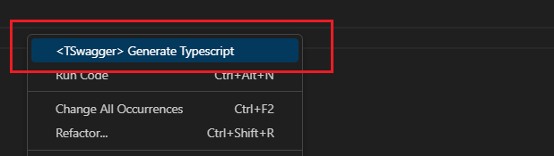
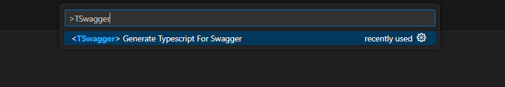
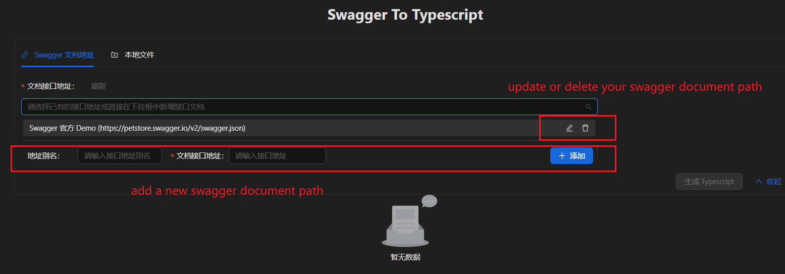
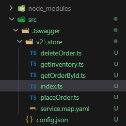

    

一款能将 Swagger 文档转换成 Typescript 接口文件的 vscode 插件  
⭐ 如果对您有帮助的话，不妨给我们一颗小星星鼓励一下

## ✨ 特点

- 👀 友好的 **可视化** 操作界面，跟命令行说再见
- 😃 可 **灵活接入** 不同的接口请求工具
- 🧮 接口级操作粒度，可 **按需选择接口** 进行转换，无需对文档进行全量转换
- 📑 **兼容中文**，支持对中文实体名称进行 **自动翻译**
- ✍️ 支持对插件自动生成的出入参类型名称/接口名称进行 **自定义修改**

## 📦 安装

在 vscode 插件市场搜索 `tswagger` ，直接安装即可。

## 🔨 开始使用

### 1. 打开插件

#### a. 右键菜单操作

#### b. 命令行进入

### 2. 选择 Swagger 文档

通过这个下拉框你可以管理 Swagger 的文档地址，无需再进入到 `settings.json` 中进行配置。

### 3. 生成结果

您可以选择相应的接口进行结果生成，可直接将结果保存至本地项目中。  
如果对生成的结果命名不满意，还可以进行重命名操作。

### 4. 查看接口文件

## 📃 说明

### config.json

`config.json` 是项目级的配置文件，它会在首次生成接口文件时自动生成，无需手动添加。  
具体配置如下所示：

| 配置项              | 说明                                                       | 类型                     | 默认值          | 版本    |
| ------------------- | ---------------------------------------------------------- | ------------------------ | --------------- | ------- |
| `fetchFilePath`     | `fetch` 文件地址，约定必须以 `@` 开头，`@` 表示 `src` 目录 | `string`                 | `@/utils/fetch` |         |
| `addBasePathPrefix` | 是否为生成的接口路径添加前缀                               | `boolean`                | `true`          |         |
| `basePathMapping`   | 接口前缀映射，如：`/api-v1` 映射为 `/api`，可配置多个      | `Record<string, string>` | -               | `1.2.0` |

### fetch 文件

约定 `fetch` 文件作为 swagger 转换结果中的请求文件，若项目中缺少 `fetch` 文件配置，插件将会在 src 下的 utils 目录自动生成一份模板文件。  
我们约定 `fetch` 文件需要透出：

- 接口请求的语法糖方法：`get`、`post`、`put`、`del`（注：`post` 方法需要兼容 `FormData` 类型的数据处理）
- 用于统一处理接口数据返回的泛型类型：`FetchResult`

这里是一份插件内置的基于 axios 编写的 [fetch 文件模板（基于 axios）](./src/requestTemplates/axios.ts)。

### service.map.yaml

`service.map.yaml` 保存了当前分组接口所生成的映射信息，若您对接口信息进行了二次重命名，它会在下一次重新生成本组接口时自动进行映射，以保证与上次结果的信息一致性，请勿手动修改。

## 🌹 感谢

特别感谢以下开源项目为本插件所带来的帮助：

- [bing-translate-api](https://github.com/plainheart/bing-translate-api)：一个基于 Bing 和 Microsoft API 封装的免费翻译工具包，为本插件的中文翻译功能提供了极大帮助

## 🤝 参与共建

本插件目前仍有许多需要完善之处，如果您遇到问题欢迎给我们提 issue ，同时也欢迎所有人参与共建。
